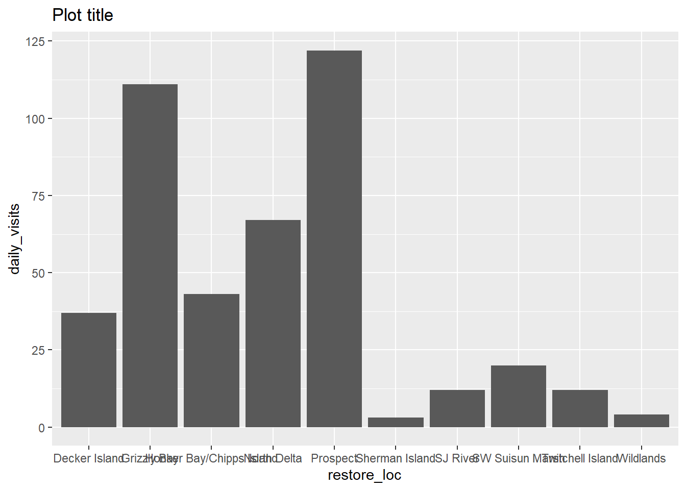
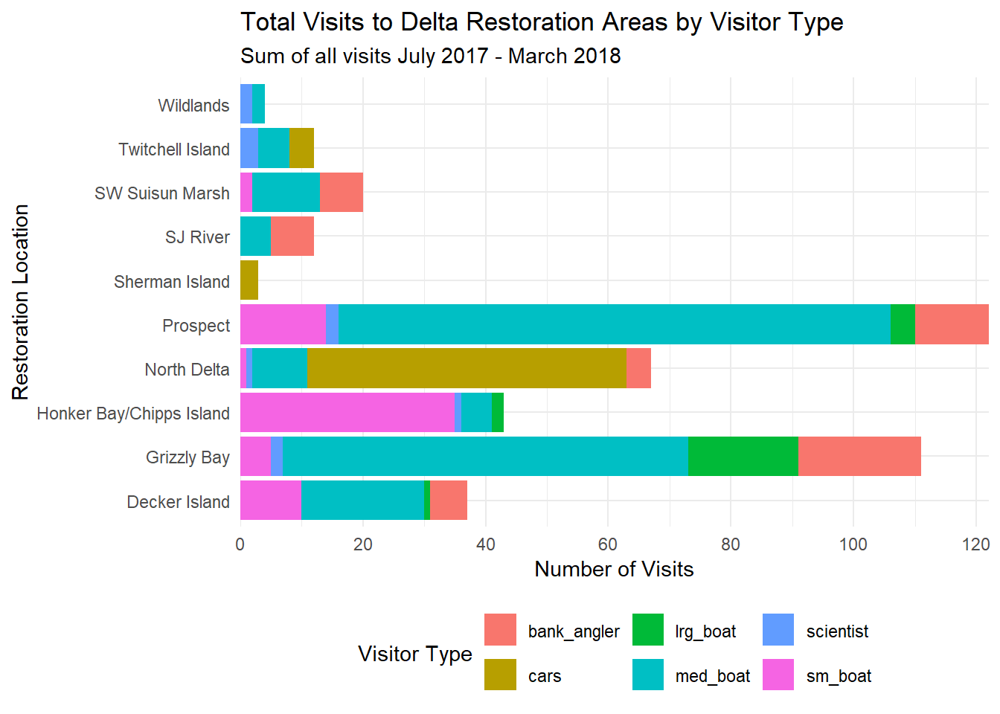
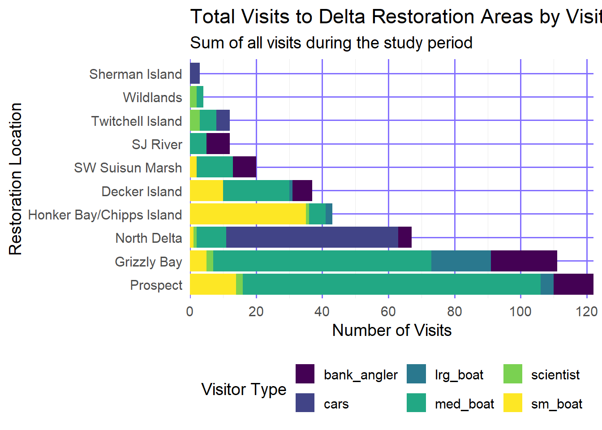
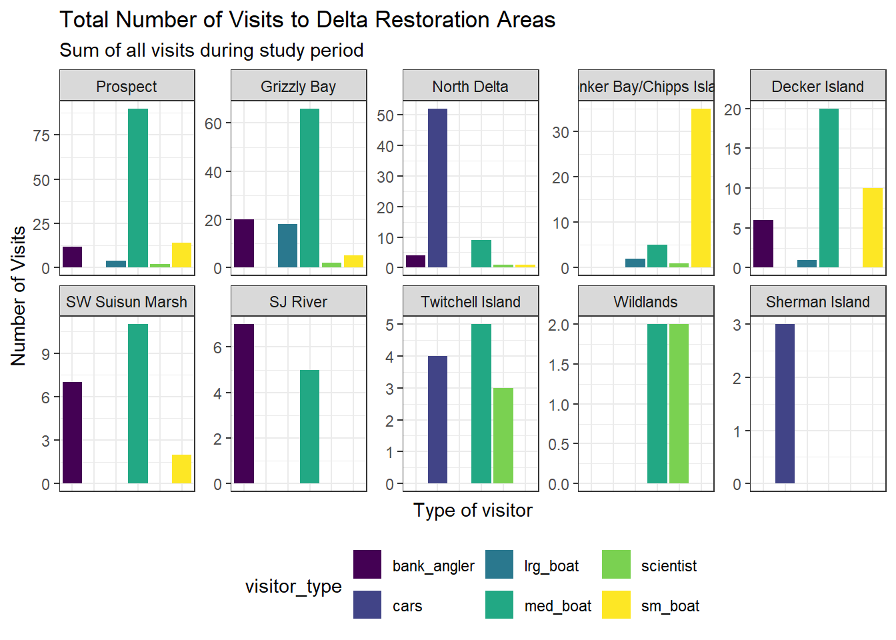
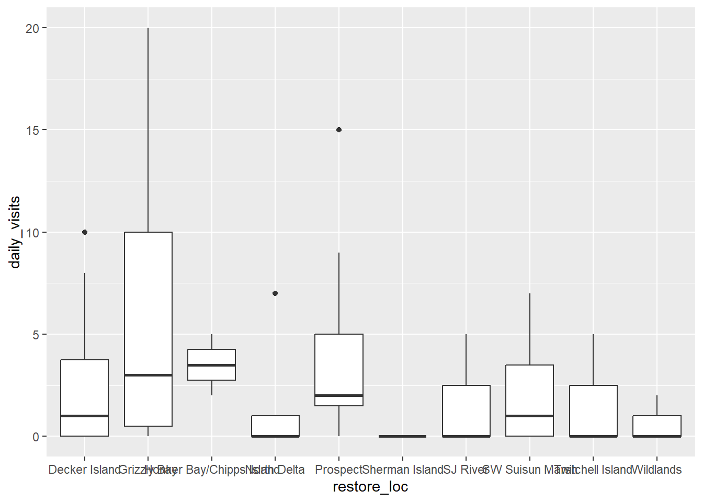

## Load Packages

::: {.cell}

```{.r .cell-code}
library(readr)
```

::: {.cell-output .cell-output-stderr}

```
Warning: package 'readr' was built under R version 4.5.3
```


:::

```{.r .cell-code}
library(here)
```

::: {.cell-output .cell-output-stderr}

```
Warning: package 'here' was built under R version 4.5.3
```


:::

::: {.cell-output .cell-output-stderr}

```
here() starts at C:/Users/kluke/Documents/NCEAS/Training
```


:::

```{.r .cell-code}
library(dplyr)
```

::: {.cell-output .cell-output-stderr}

```
Warning: package 'dplyr' was built under R version 4.5.3
```


:::

::: {.cell-output .cell-output-stderr}

```

Attaching package: 'dplyr'
```


:::

::: {.cell-output .cell-output-stderr}

```
The following objects are masked from 'package:stats':

    filter, lag
```


:::

::: {.cell-output .cell-output-stderr}

```
The following objects are masked from 'package:base':

    intersect, setdiff, setequal, union
```


:::

```{.r .cell-code}
library(tidyr)
```

::: {.cell-output .cell-output-stderr}

```
Warning: package 'tidyr' was built under R version 4.5.3
```


:::

```{.r .cell-code}
library(forcats)
library(janitor)
```

::: {.cell-output .cell-output-stderr}

```

Attaching package: 'janitor'
```


:::

::: {.cell-output .cell-output-stderr}

```
The following objects are masked from 'package:stats':

    chisq.test, fisher.test
```


:::

```{.r .cell-code}
library(ggplot2)

library(plotly)
```

::: {.cell-output .cell-output-stderr}

```

Attaching package: 'plotly'
```


:::

::: {.cell-output .cell-output-stderr}

```
The following object is masked from 'package:ggplot2':

    last_plot
```


:::

::: {.cell-output .cell-output-stderr}

```
The following object is masked from 'package:stats':

    filter
```


:::

::: {.cell-output .cell-output-stderr}

```
The following object is masked from 'package:graphics':

    layout
```


:::
:::


## Load Data


::: {.cell}

```{.r .cell-code}
delta_visits_raw <- read_csv("http://tinyurl.com/delta-activities")
```

::: {.cell-output .cell-output-stderr}

```
Rows: 55 Columns: 13
── Column specification ────────────────────────────────────────────────────────
Delimiter: ","
chr  (4): EcoRestore_approximate_location, Reach, Time_of_Day, notes
dbl  (8): Latitude, Longitude, sm_boat, med_boat, lrg_boat, bank_angler, sci...
date (1): Date

ℹ Use `spec()` to retrieve the full column specification for this data.
ℹ Specify the column types or set `show_col_types = FALSE` to quiet this message.
```


:::
:::


## Explore data


::: {.cell}

```{.r .cell-code}
colnames(delta_visits_raw)
```

::: {.cell-output .cell-output-stdout}

```
 [1] "EcoRestore_approximate_location" "Reach"                          
 [3] "Latitude"                        "Longitude"                      
 [5] "Date"                            "Time_of_Day"                    
 [7] "sm_boat"                         "med_boat"                       
 [9] "lrg_boat"                        "bank_angler"                    
[11] "scientist"                       "cars"                           
[13] "notes"                          
```


:::

```{.r .cell-code}
summary(delta_visits_raw)
```

::: {.cell-output .cell-output-stdout}

```
 EcoRestore_approximate_location    Reach              Latitude    
 Length:55                       Length:55          Min.   :38.02  
 Class :character                Class :character   1st Qu.:38.08  
 Mode  :character                Mode  :character   Median :38.12  
                                                    Mean   :38.15  
                                                    3rd Qu.:38.23  
                                                    Max.   :38.35  
   Longitude           Date            Time_of_Day           sm_boat      
 Min.   :-122.1   Min.   :2017-07-07   Length:55          Min.   : 0.000  
 1st Qu.:-121.9   1st Qu.:2017-09-29   Class :character   1st Qu.: 0.000  
 Median :-121.7   Median :2017-11-02   Mode  :character   Median : 0.000  
 Mean   :-121.8   Mean   :2017-11-05                      Mean   : 1.218  
 3rd Qu.:-121.7   3rd Qu.:2017-12-08                      3rd Qu.: 1.000  
 Max.   :-121.6   Max.   :2018-03-13                      Max.   :35.000  
    med_boat         lrg_boat       bank_angler      scientist  
 Min.   : 0.000   Min.   :0.0000   Min.   :0.000   Min.   :0.0  
 1st Qu.: 0.000   1st Qu.:0.0000   1st Qu.:0.000   1st Qu.:0.0  
 Median : 1.000   Median :0.0000   Median :0.000   Median :0.0  
 Mean   : 3.873   Mean   :0.4545   Mean   :1.018   Mean   :0.2  
 3rd Qu.: 4.000   3rd Qu.:0.0000   3rd Qu.:2.000   3rd Qu.:0.0  
 Max.   :45.000   Max.   :9.0000   Max.   :9.000   Max.   :2.0  
      cars           notes          
 Min.   : 0.000   Length:55         
 1st Qu.: 0.000   Class :character  
 Median : 0.000   Mode  :character  
 Mean   : 1.073                     
 3rd Qu.: 0.000                     
 Max.   :18.000                     
```


:::

```{.r .cell-code}
head(delta_visits_raw)
```

::: {.cell-output .cell-output-stdout}

```
# A tibble: 6 × 13
  EcoRestore_approxima…¹ Reach Latitude Longitude Date       Time_of_Day sm_boat
  <chr>                  <chr>    <dbl>     <dbl> <date>     <chr>         <dbl>
1 Decker Island          Bran…     38.1     -122. 2017-07-07 unknown           0
2 Decker Island          Deck…     38.1     -122. 2017-07-07 unknown           0
3 Decker Island          Deck…     38.1     -122. 2017-07-07 unknown           0
4 Decker Island          Deck…     38.1     -122. 2017-09-13 unknown           0
5 Decker Island          Bran…     38.1     -122. 2017-11-07 unknown           2
6 Decker Island          Deck…     38.1     -122. 2017-11-07 unknown           0
# ℹ abbreviated name: ¹​EcoRestore_approximate_location
# ℹ 6 more variables: med_boat <dbl>, lrg_boat <dbl>, bank_angler <dbl>,
#   scientist <dbl>, cars <dbl>, notes <chr>
```


:::
:::


## Tidy data


::: {.cell}

```{.r .cell-code}
delta_visits <- delta_visits_raw %>% 
    clean_names()
delta_visits
```

::: {.cell-output .cell-output-stdout}

```
# A tibble: 55 × 13
   eco_restore_approximate_loc…¹ reach latitude longitude date       time_of_day
   <chr>                         <chr>    <dbl>     <dbl> <date>     <chr>      
 1 Decker Island                 Bran…     38.1     -122. 2017-07-07 unknown    
 2 Decker Island                 Deck…     38.1     -122. 2017-07-07 unknown    
 3 Decker Island                 Deck…     38.1     -122. 2017-07-07 unknown    
 4 Decker Island                 Deck…     38.1     -122. 2017-09-13 unknown    
 5 Decker Island                 Bran…     38.1     -122. 2017-11-07 unknown    
 6 Decker Island                 Deck…     38.1     -122. 2017-11-07 unknown    
 7 Decker Island                 Deck…     38.1     -122. 2017-11-07 unknown    
 8 Decker Island                 Bran…     38.1     -122. 2017-12-08 morning    
 9 Decker Island                 Deck…     38.1     -122. 2017-12-08 morning    
10 Decker Island                 Deck…     38.1     -122. 2017-12-08 morning    
# ℹ 45 more rows
# ℹ abbreviated name: ¹​eco_restore_approximate_location
# ℹ 7 more variables: sm_boat <dbl>, med_boat <dbl>, lrg_boat <dbl>,
#   bank_angler <dbl>, scientist <dbl>, cars <dbl>, notes <chr>
```


:::

```{.r .cell-code}
visits_long <- delta_visits %>%
  tidyr::pivot_longer(
    cols = c(sm_boat, med_boat, lrg_boat, bank_angler, scientist, cars),
    names_to = "visitor_type",
    values_to = "quantity"
  ) %>%
  ### shorten the long name:
  dplyr::rename(restore_loc = eco_restore_approximate_location) %>%
  ### drop the notes column:
  dplyr::select(-notes)

glimpse(visits_long)
```

::: {.cell-output .cell-output-stdout}

```
Rows: 330
Columns: 8
$ restore_loc  <chr> "Decker Island", "Decker Island", "Decker Island", "Decke…
$ reach        <chr> "Brannan to Decker Island", "Brannan to Decker Island", "…
$ latitude     <dbl> 38.10587, 38.10587, 38.10587, 38.10587, 38.10587, 38.1058…
$ longitude    <dbl> -121.7064, -121.7064, -121.7064, -121.7064, -121.7064, -1…
$ date         <date> 2017-07-07, 2017-07-07, 2017-07-07, 2017-07-07, 2017-07-…
$ time_of_day  <chr> "unknown", "unknown", "unknown", "unknown", "unknown", "u…
$ visitor_type <chr> "sm_boat", "med_boat", "lrg_boat", "bank_angler", "scient…
$ quantity     <dbl> 0, 2, 0, 1, 0, 0, 0, 4, 0, 3, 0, 0, 0, 0, 0, 0, 0, 0, 0, …
```


:::
:::


::: {.cell}

```{.r .cell-code}
daily_visits_loc <- visits_long %>% 
    group_by(restore_loc, date, visitor_type) %>% 
    summarize(daily_visits= sum(quantity),
    .groups= "drop")

daily_visits_loc
```

::: {.cell-output .cell-output-stdout}

```
# A tibble: 144 × 4
   restore_loc   date       visitor_type daily_visits
   <chr>         <date>     <chr>               <dbl>
 1 Decker Island 2017-07-07 bank_angler             4
 2 Decker Island 2017-07-07 cars                    0
 3 Decker Island 2017-07-07 lrg_boat                0
 4 Decker Island 2017-07-07 med_boat                6
 5 Decker Island 2017-07-07 scientist               0
 6 Decker Island 2017-07-07 sm_boat                 0
 7 Decker Island 2017-09-13 bank_angler             0
 8 Decker Island 2017-09-13 cars                    0
 9 Decker Island 2017-09-13 lrg_boat                0
10 Decker Island 2017-09-13 med_boat                1
# ℹ 134 more rows
```


:::
:::


::: {.cell}

```{.r .cell-code}
ggplot(data = daily_visits_loc,
       mapping = aes(x = restore_loc, y = daily_visits)) +
  geom_col() + 
  labs(title = 'Plot title')
```

::: {.cell-output-display}
{width=672}
:::
:::


::: {.cell}

```{.r .cell-code}
plot1 <- daily_visits_loc %>% 
    filter(daily_visits<30,
        visitor_type %in% c("sm_boat", "med_boat","lrg_boat")) %>% 
    ggplot(aes(x=restore_loc, y=daily_visits))+
    geom_boxplot()
```
:::


::: {.cell}

```{.r .cell-code}
ggplot(data = daily_visits_loc,
       aes(y = restore_loc, x = daily_visits, fill = visitor_type)) +
  geom_col() +
  labs(x = "Number of Visits",
       y = "Restoration Location",
       fill = "Visitor Type",
       title = "Total Visits to Delta Restoration Areas by Visitor Type",
       subtitle = "Sum of all visits July 2017 - March 2018") +
  scale_x_continuous(breaks = seq(0, 120, 20), expand = c(0, 0)) +
  theme_minimal() +
  theme(
    legend.position = "bottom",
    axis.ticks.y = element_blank()
  )
```

::: {.cell-output-display}
{width=672}
:::
:::


::: {.cell}

```{.r .cell-code}
daily_visits_totals <- daily_visits_loc %>%
  group_by(restore_loc) %>%
  mutate(total = sum(daily_visits)) %>%
  ungroup() %>%
  mutate(restore_loc = fct_reorder(restore_loc, desc(total)))

unique(daily_visits_totals$restore_loc)
```

::: {.cell-output .cell-output-stdout}

```
 [1] Decker Island            Grizzly Bay              Honker Bay/Chipps Island
 [4] North Delta              Prospect                 SJ River                
 [7] SW Suisun Marsh          Sherman Island           Twitchell Island        
[10] Wildlands               
10 Levels: Prospect Grizzly Bay North Delta ... Sherman Island
```


:::
:::


::: {.cell}

```{.r .cell-code}
my_theme <- function(base_size = 14) {
    theme_minimal(base_size = base_size) +
    theme(legend.position = "bottom", 
          panel.grid.major = element_line(color = 'slateblue1'))
}

ggplot(data = daily_visits_totals,
       aes(y = restore_loc, x = daily_visits, fill = visitor_type)) +
  geom_col() +
  scale_fill_viridis_d() +
  scale_x_continuous(breaks = seq(0, 120, 20), expand = c(0, 0)) +
  labs(
    x = "Number of Visits",
    y = "Restoration Location",
    fill = "Visitor Type",
    title = "Total Visits to Delta Restoration Areas by Visitor Type",
    subtitle = "Sum of all visits during the study period"
  ) +
  my_theme()
```

::: {.cell-output-display}
{width=672}
:::
:::


::: {.cell}

```{.r .cell-code}
facet_plot <- ggplot(data = daily_visits_totals,
       aes(x = visitor_type, y = daily_visits,
           fill = visitor_type)) +
    geom_col() +
    facet_wrap(~restore_loc,
               scales = "free_y",
               ncol   = 5,
               nrow   = 2) +
    scale_fill_viridis_d() +
    labs(x        = "Type of visitor",
         y        = "Number of Visits",
         title    = "Total Number of Visits to Delta Restoration Areas",
         subtitle = "Sum of all visits during study period") +
    theme_bw() +
    theme(legend.position = "bottom",
          axis.ticks.x    = element_blank(),
          axis.text.x     = element_blank())

facet_plot
```

::: {.cell-output-display}
{width=672}
:::

```{.r .cell-code}
plot1
```

::: {.cell-output-display}
{width=672}
:::

```{.r .cell-code}
ggplotly(facet_plot, tooltip = c('x', 'y'))
```

::: {.cell-output-display}

```{=html}
<div class="plotly html-widget html-fill-item" id="htmlwidget-bfb7769892dcc117c41d" style="width:100%;height:464px;"></div>
<script type="application/json" data-for="htmlwidget-bfb7769892dcc117c41d">{"x":{"data":[{"orientation":"v","width":[0.89999999999999991,0.89999999999999991,0.89999999999999991,0.89999999999999991],"base":[0,2,2,8],"x":[1,1,1,1],"y":[2,0,6,4],"text":["visitor_type: bank_angler<br />daily_visits:  2","visitor_type: bank_angler<br />daily_visits:  0","visitor_type: bank_angler<br />daily_visits:  6","visitor_type: bank_angler<br />daily_visits:  4"],"type":"bar","textposition":"none","marker":{"autocolorscale":false,"color":"rgba(68,1,84,1)","line":{"width":1.8897637795275593,"color":"transparent"}},"name":"bank_angler","legendgroup":"bank_angler","showlegend":true,"xaxis":"x","yaxis":"y","hoverinfo":"text","frame":null},{"orientation":"v","width":[0.89999999999999991,0.89999999999999991,0.89999999999999991,0.89999999999999991,0.89999999999999991],"base":[0,0,0,9,11],"x":[1,1,1,1,1],"y":[0,0,9,2,9],"text":["visitor_type: bank_angler<br />daily_visits:  0","visitor_type: bank_angler<br />daily_visits:  0","visitor_type: bank_angler<br />daily_visits:  9","visitor_type: bank_angler<br />daily_visits:  2","visitor_type: bank_angler<br />daily_visits:  9"],"type":"bar","textposition":"none","marker":{"autocolorscale":false,"color":"rgba(68,1,84,1)","line":{"width":1.8897637795275593,"color":"transparent"}},"name":"bank_angler","legendgroup":"bank_angler","showlegend":false,"xaxis":"x2","yaxis":"y2","hoverinfo":"text","frame":null},{"orientation":"v","width":[0.89999999999999991,0.89999999999999991,0.89999999999999991,0.89999999999999991],"base":[0,3,3,4],"x":[1,1,1,1],"y":[3,0,1,0],"text":["visitor_type: bank_angler<br />daily_visits:  3","visitor_type: bank_angler<br />daily_visits:  0","visitor_type: bank_angler<br />daily_visits:  1","visitor_type: bank_angler<br />daily_visits:  0"],"type":"bar","textposition":"none","marker":{"autocolorscale":false,"color":"rgba(68,1,84,1)","line":{"width":1.8897637795275593,"color":"transparent"}},"name":"bank_angler","legendgroup":"bank_angler","showlegend":false,"xaxis":"x3","yaxis":"y3","hoverinfo":"text","frame":null},{"orientation":"v","width":0.89999999999999991,"base":0,"x":[1],"y":[0],"text":"visitor_type: bank_angler<br />daily_visits:  0","type":"bar","textposition":"none","marker":{"autocolorscale":false,"color":"rgba(68,1,84,1)","line":{"width":1.8897637795275593,"color":"transparent"}},"name":"bank_angler","legendgroup":"bank_angler","showlegend":false,"xaxis":"x4","yaxis":"y4","hoverinfo":"text","frame":null},{"orientation":"v","width":[0.89999999999999991,0.89999999999999991,0.89999999999999991,0.89999999999999991],"base":[0,4,4,4],"x":[1,1,1,1],"y":[4,0,0,2],"text":["visitor_type: bank_angler<br />daily_visits:  4","visitor_type: bank_angler<br />daily_visits:  0","visitor_type: bank_angler<br />daily_visits:  0","visitor_type: bank_angler<br />daily_visits:  2"],"type":"bar","textposition":"none","marker":{"autocolorscale":false,"color":"rgba(68,1,84,1)","line":{"width":1.8897637795275593,"color":"transparent"}},"name":"bank_angler","legendgroup":"bank_angler","showlegend":false,"xaxis":"x5","yaxis":"y5","hoverinfo":"text","frame":null},{"orientation":"v","width":[0.89999999999999991,0.89999999999999991],"base":[0,5],"x":[1,1],"y":[5,2],"text":["visitor_type: bank_angler<br />daily_visits:  5","visitor_type: bank_angler<br />daily_visits:  2"],"type":"bar","textposition":"none","marker":{"autocolorscale":false,"color":"rgba(68,1,84,1)","line":{"width":1.8897637795275593,"color":"transparent"}},"name":"bank_angler","legendgroup":"bank_angler","showlegend":false,"xaxis":"x","yaxis":"y6","hoverinfo":"text","frame":null},{"orientation":"v","width":0.89999999999999991,"base":0,"x":[1],"y":[7],"text":"visitor_type: bank_angler<br />daily_visits:  7","type":"bar","textposition":"none","marker":{"autocolorscale":false,"color":"rgba(68,1,84,1)","line":{"width":1.8897637795275593,"color":"transparent"}},"name":"bank_angler","legendgroup":"bank_angler","showlegend":false,"xaxis":"x2","yaxis":"y7","hoverinfo":"text","frame":null},{"orientation":"v","width":0.89999999999999991,"base":0,"x":[1],"y":[0],"text":"visitor_type: bank_angler<br />daily_visits:  0","type":"bar","textposition":"none","marker":{"autocolorscale":false,"color":"rgba(68,1,84,1)","line":{"width":1.8897637795275593,"color":"transparent"}},"name":"bank_angler","legendgroup":"bank_angler","showlegend":false,"xaxis":"x3","yaxis":"y8","hoverinfo":"text","frame":null},{"orientation":"v","width":0.89999999999999991,"base":0,"x":[1],"y":[0],"text":"visitor_type: bank_angler<br />daily_visits:  0","type":"bar","textposition":"none","marker":{"autocolorscale":false,"color":"rgba(68,1,84,1)","line":{"width":1.8897637795275593,"color":"transparent"}},"name":"bank_angler","legendgroup":"bank_angler","showlegend":false,"xaxis":"x4","yaxis":"y9","hoverinfo":"text","frame":null},{"orientation":"v","width":0.89999999999999991,"base":0,"x":[1],"y":[0],"text":"visitor_type: bank_angler<br />daily_visits:  0","type":"bar","textposition":"none","marker":{"autocolorscale":false,"color":"rgba(68,1,84,1)","line":{"width":1.8897637795275593,"color":"transparent"}},"name":"bank_angler","legendgroup":"bank_angler","showlegend":false,"xaxis":"x5","yaxis":"y10","hoverinfo":"text","frame":null},{"orientation":"v","width":[0.90000000000000013,0.90000000000000013,0.90000000000000013,0.90000000000000013],"base":[0,0,0,0],"x":[2,2,2,2],"y":[0,0,0,0],"text":"visitor_type: cars<br />daily_visits:  0","type":"bar","textposition":"none","marker":{"autocolorscale":false,"color":"rgba(65,68,135,1)","line":{"width":1.8897637795275593,"color":"transparent"}},"name":"cars","legendgroup":"cars","showlegend":true,"xaxis":"x","yaxis":"y","hoverinfo":"text","frame":null},{"orientation":"v","width":[0.90000000000000013,0.90000000000000013,0.90000000000000013,0.90000000000000013,0.90000000000000013],"base":[0,0,0,0,0],"x":[2,2,2,2,2],"y":[0,0,0,0,0],"text":"visitor_type: cars<br />daily_visits:  0","type":"bar","textposition":"none","marker":{"autocolorscale":false,"color":"rgba(65,68,135,1)","line":{"width":1.8897637795275593,"color":"transparent"}},"name":"cars","legendgroup":"cars","showlegend":false,"xaxis":"x2","yaxis":"y2","hoverinfo":"text","frame":null},{"orientation":"v","width":[0.90000000000000013,0.90000000000000013,0.90000000000000013,0.90000000000000013],"base":[0,40,43,52],"x":[2,2,2,2],"y":[40,3,9,0],"text":["visitor_type: cars<br />daily_visits: 40","visitor_type: cars<br />daily_visits:  3","visitor_type: cars<br />daily_visits:  9","visitor_type: cars<br />daily_visits:  0"],"type":"bar","textposition":"none","marker":{"autocolorscale":false,"color":"rgba(65,68,135,1)","line":{"width":1.8897637795275593,"color":"transparent"}},"name":"cars","legendgroup":"cars","showlegend":false,"xaxis":"x3","yaxis":"y3","hoverinfo":"text","frame":null},{"orientation":"v","width":0.90000000000000013,"base":0,"x":[2],"y":[0],"text":"visitor_type: cars<br />daily_visits:  0","type":"bar","textposition":"none","marker":{"autocolorscale":false,"color":"rgba(65,68,135,1)","line":{"width":1.8897637795275593,"color":"transparent"}},"name":"cars","legendgroup":"cars","showlegend":false,"xaxis":"x4","yaxis":"y4","hoverinfo":"text","frame":null},{"orientation":"v","width":[0.90000000000000013,0.90000000000000013,0.90000000000000013,0.90000000000000013],"base":[0,0,0,0],"x":[2,2,2,2],"y":[0,0,0,0],"text":"visitor_type: cars<br />daily_visits:  0","type":"bar","textposition":"none","marker":{"autocolorscale":false,"color":"rgba(65,68,135,1)","line":{"width":1.8897637795275593,"color":"transparent"}},"name":"cars","legendgroup":"cars","showlegend":false,"xaxis":"x5","yaxis":"y5","hoverinfo":"text","frame":null},{"orientation":"v","width":[0.90000000000000013,0.90000000000000013],"base":[0,0],"x":[2,2],"y":[0,0],"text":"visitor_type: cars<br />daily_visits:  0","type":"bar","textposition":"none","marker":{"autocolorscale":false,"color":"rgba(65,68,135,1)","line":{"width":1.8897637795275593,"color":"transparent"}},"name":"cars","legendgroup":"cars","showlegend":false,"xaxis":"x","yaxis":"y6","hoverinfo":"text","frame":null},{"orientation":"v","width":0.90000000000000013,"base":0,"x":[2],"y":[0],"text":"visitor_type: cars<br />daily_visits:  0","type":"bar","textposition":"none","marker":{"autocolorscale":false,"color":"rgba(65,68,135,1)","line":{"width":1.8897637795275593,"color":"transparent"}},"name":"cars","legendgroup":"cars","showlegend":false,"xaxis":"x2","yaxis":"y7","hoverinfo":"text","frame":null},{"orientation":"v","width":0.90000000000000013,"base":0,"x":[2],"y":[4],"text":"visitor_type: cars<br />daily_visits:  4","type":"bar","textposition":"none","marker":{"autocolorscale":false,"color":"rgba(65,68,135,1)","line":{"width":1.8897637795275593,"color":"transparent"}},"name":"cars","legendgroup":"cars","showlegend":false,"xaxis":"x3","yaxis":"y8","hoverinfo":"text","frame":null},{"orientation":"v","width":0.90000000000000013,"base":0,"x":[2],"y":[0],"text":"visitor_type: cars<br />daily_visits:  0","type":"bar","textposition":"none","marker":{"autocolorscale":false,"color":"rgba(65,68,135,1)","line":{"width":1.8897637795275593,"color":"transparent"}},"name":"cars","legendgroup":"cars","showlegend":false,"xaxis":"x4","yaxis":"y9","hoverinfo":"text","frame":null},{"orientation":"v","width":0.90000000000000013,"base":0,"x":[2],"y":[3],"text":"visitor_type: cars<br />daily_visits:  3","type":"bar","textposition":"none","marker":{"autocolorscale":false,"color":"rgba(65,68,135,1)","line":{"width":1.8897637795275593,"color":"transparent"}},"name":"cars","legendgroup":"cars","showlegend":false,"xaxis":"x5","yaxis":"y10","hoverinfo":"text","frame":null},{"orientation":"v","width":[0.90000000000000036,0.90000000000000036,0.90000000000000036,0.90000000000000036],"base":[0,0,1,4],"x":[3,3,3,3],"y":[0,1,3,0],"text":["visitor_type: lrg_boat<br />daily_visits:  0","visitor_type: lrg_boat<br />daily_visits:  1","visitor_type: lrg_boat<br />daily_visits:  3","visitor_type: lrg_boat<br />daily_visits:  0"],"type":"bar","textposition":"none","marker":{"autocolorscale":false,"color":"rgba(42,120,142,1)","line":{"width":1.8897637795275593,"color":"transparent"}},"name":"lrg_boat","legendgroup":"lrg_boat","showlegend":true,"xaxis":"x","yaxis":"y","hoverinfo":"text","frame":null},{"orientation":"v","width":[0.90000000000000036,0.90000000000000036,0.90000000000000036,0.90000000000000036,0.90000000000000036],"base":[0,0,5,8,18],"x":[3,3,3,3,3],"y":[0,5,3,10,0],"text":["visitor_type: lrg_boat<br />daily_visits:  0","visitor_type: lrg_boat<br />daily_visits:  5","visitor_type: lrg_boat<br />daily_visits:  3","visitor_type: lrg_boat<br />daily_visits: 10","visitor_type: lrg_boat<br />daily_visits:  0"],"type":"bar","textposition":"none","marker":{"autocolorscale":false,"color":"rgba(42,120,142,1)","line":{"width":1.8897637795275593,"color":"transparent"}},"name":"lrg_boat","legendgroup":"lrg_boat","showlegend":false,"xaxis":"x2","yaxis":"y2","hoverinfo":"text","frame":null},{"orientation":"v","width":[0.90000000000000036,0.90000000000000036,0.90000000000000036,0.90000000000000036],"base":[0,0,0,0],"x":[3,3,3,3],"y":[0,0,0,0],"text":"visitor_type: lrg_boat<br />daily_visits:  0","type":"bar","textposition":"none","marker":{"autocolorscale":false,"color":"rgba(42,120,142,1)","line":{"width":1.8897637795275593,"color":"transparent"}},"name":"lrg_boat","legendgroup":"lrg_boat","showlegend":false,"xaxis":"x3","yaxis":"y3","hoverinfo":"text","frame":null},{"orientation":"v","width":0.90000000000000036,"base":0,"x":[3],"y":[2],"text":"visitor_type: lrg_boat<br />daily_visits:  2","type":"bar","textposition":"none","marker":{"autocolorscale":false,"color":"rgba(42,120,142,1)","line":{"width":1.8897637795275593,"color":"transparent"}},"name":"lrg_boat","legendgroup":"lrg_boat","showlegend":false,"xaxis":"x4","yaxis":"y4","hoverinfo":"text","frame":null},{"orientation":"v","width":[0.90000000000000036,0.90000000000000036,0.90000000000000036,0.90000000000000036],"base":[0,0,0,1],"x":[3,3,3,3],"y":[0,0,1,0],"text":["visitor_type: lrg_boat<br />daily_visits:  0","visitor_type: lrg_boat<br />daily_visits:  0","visitor_type: lrg_boat<br />daily_visits:  1","visitor_type: lrg_boat<br />daily_visits:  0"],"type":"bar","textposition":"none","marker":{"autocolorscale":false,"color":"rgba(42,120,142,1)","line":{"width":1.8897637795275593,"color":"transparent"}},"name":"lrg_boat","legendgroup":"lrg_boat","showlegend":false,"xaxis":"x5","yaxis":"y5","hoverinfo":"text","frame":null},{"orientation":"v","width":[0.90000000000000036,0.90000000000000036],"base":[0,0],"x":[3,3],"y":[0,0],"text":"visitor_type: lrg_boat<br />daily_visits:  0","type":"bar","textposition":"none","marker":{"autocolorscale":false,"color":"rgba(42,120,142,1)","line":{"width":1.8897637795275593,"color":"transparent"}},"name":"lrg_boat","legendgroup":"lrg_boat","showlegend":false,"xaxis":"x","yaxis":"y6","hoverinfo":"text","frame":null},{"orientation":"v","width":0.90000000000000036,"base":0,"x":[3],"y":[0],"text":"visitor_type: lrg_boat<br />daily_visits:  0","type":"bar","textposition":"none","marker":{"autocolorscale":false,"color":"rgba(42,120,142,1)","line":{"width":1.8897637795275593,"color":"transparent"}},"name":"lrg_boat","legendgroup":"lrg_boat","showlegend":false,"xaxis":"x2","yaxis":"y7","hoverinfo":"text","frame":null},{"orientation":"v","width":0.90000000000000036,"base":0,"x":[3],"y":[0],"text":"visitor_type: lrg_boat<br />daily_visits:  0","type":"bar","textposition":"none","marker":{"autocolorscale":false,"color":"rgba(42,120,142,1)","line":{"width":1.8897637795275593,"color":"transparent"}},"name":"lrg_boat","legendgroup":"lrg_boat","showlegend":false,"xaxis":"x3","yaxis":"y8","hoverinfo":"text","frame":null},{"orientation":"v","width":0.90000000000000036,"base":0,"x":[3],"y":[0],"text":"visitor_type: lrg_boat<br />daily_visits:  0","type":"bar","textposition":"none","marker":{"autocolorscale":false,"color":"rgba(42,120,142,1)","line":{"width":1.8897637795275593,"color":"transparent"}},"name":"lrg_boat","legendgroup":"lrg_boat","showlegend":false,"xaxis":"x4","yaxis":"y9","hoverinfo":"text","frame":null},{"orientation":"v","width":0.90000000000000036,"base":0,"x":[3],"y":[0],"text":"visitor_type: lrg_boat<br />daily_visits:  0","type":"bar","textposition":"none","marker":{"autocolorscale":false,"color":"rgba(42,120,142,1)","line":{"width":1.8897637795275593,"color":"transparent"}},"name":"lrg_boat","legendgroup":"lrg_boat","showlegend":false,"xaxis":"x5","yaxis":"y10","hoverinfo":"text","frame":null},{"orientation":"v","width":[0.90000000000000036,0.90000000000000036,0.90000000000000036,0.90000000000000036],"base":[0,2,17,81],"x":[4,4,4,4],"y":[2,15,64,9],"text":["visitor_type: med_boat<br />daily_visits:  2","visitor_type: med_boat<br />daily_visits: 15","visitor_type: med_boat<br />daily_visits: 64","visitor_type: med_boat<br />daily_visits:  9"],"type":"bar","textposition":"none","marker":{"autocolorscale":false,"color":"rgba(34,168,132,1)","line":{"width":1.8897637795275593,"color":"transparent"}},"name":"med_boat","legendgroup":"med_boat","showlegend":true,"xaxis":"x","yaxis":"y","hoverinfo":"text","frame":null},{"orientation":"v","width":[0.90000000000000036,0.90000000000000036,0.90000000000000036,0.90000000000000036,0.90000000000000036],"base":[0,1,11,30,50],"x":[4,4,4,4,4],"y":[1,10,19,20,16],"text":["visitor_type: med_boat<br />daily_visits:  1","visitor_type: med_boat<br />daily_visits: 10","visitor_type: med_boat<br />daily_visits: 19","visitor_type: med_boat<br />daily_visits: 20","visitor_type: med_boat<br />daily_visits: 16"],"type":"bar","textposition":"none","marker":{"autocolorscale":false,"color":"rgba(34,168,132,1)","line":{"width":1.8897637795275593,"color":"transparent"}},"name":"med_boat","legendgroup":"med_boat","showlegend":false,"xaxis":"x2","yaxis":"y2","hoverinfo":"text","frame":null},{"orientation":"v","width":[0.90000000000000036,0.90000000000000036,0.90000000000000036,0.90000000000000036],"base":[0,7,8,9],"x":[4,4,4,4],"y":[7,1,1,0],"text":["visitor_type: med_boat<br />daily_visits:  7","visitor_type: med_boat<br />daily_visits:  1","visitor_type: med_boat<br />daily_visits:  1","visitor_type: med_boat<br />daily_visits:  0"],"type":"bar","textposition":"none","marker":{"autocolorscale":false,"color":"rgba(34,168,132,1)","line":{"width":1.8897637795275593,"color":"transparent"}},"name":"med_boat","legendgroup":"med_boat","showlegend":false,"xaxis":"x3","yaxis":"y3","hoverinfo":"text","frame":null},{"orientation":"v","width":0.90000000000000036,"base":0,"x":[4],"y":[5],"text":"visitor_type: med_boat<br />daily_visits:  5","type":"bar","textposition":"none","marker":{"autocolorscale":false,"color":"rgba(34,168,132,1)","line":{"width":1.8897637795275593,"color":"transparent"}},"name":"med_boat","legendgroup":"med_boat","showlegend":false,"xaxis":"x4","yaxis":"y4","hoverinfo":"text","frame":null},{"orientation":"v","width":[0.90000000000000036,0.90000000000000036,0.90000000000000036,0.90000000000000036],"base":[0,6,7,17],"x":[4,4,4,4],"y":[6,1,10,3],"text":["visitor_type: med_boat<br />daily_visits:  6","visitor_type: med_boat<br />daily_visits:  1","visitor_type: med_boat<br />daily_visits: 10","visitor_type: med_boat<br />daily_visits:  3"],"type":"bar","textposition":"none","marker":{"autocolorscale":false,"color":"rgba(34,168,132,1)","line":{"width":1.8897637795275593,"color":"transparent"}},"name":"med_boat","legendgroup":"med_boat","showlegend":false,"xaxis":"x5","yaxis":"y5","hoverinfo":"text","frame":null},{"orientation":"v","width":[0.90000000000000036,0.90000000000000036],"base":[0,7],"x":[4,4],"y":[7,4],"text":["visitor_type: med_boat<br />daily_visits:  7","visitor_type: med_boat<br />daily_visits:  4"],"type":"bar","textposition":"none","marker":{"autocolorscale":false,"color":"rgba(34,168,132,1)","line":{"width":1.8897637795275593,"color":"transparent"}},"name":"med_boat","legendgroup":"med_boat","showlegend":false,"xaxis":"x","yaxis":"y6","hoverinfo":"text","frame":null},{"orientation":"v","width":0.90000000000000036,"base":0,"x":[4],"y":[5],"text":"visitor_type: med_boat<br />daily_visits:  5","type":"bar","textposition":"none","marker":{"autocolorscale":false,"color":"rgba(34,168,132,1)","line":{"width":1.8897637795275593,"color":"transparent"}},"name":"med_boat","legendgroup":"med_boat","showlegend":false,"xaxis":"x2","yaxis":"y7","hoverinfo":"text","frame":null},{"orientation":"v","width":0.90000000000000036,"base":0,"x":[4],"y":[5],"text":"visitor_type: med_boat<br />daily_visits:  5","type":"bar","textposition":"none","marker":{"autocolorscale":false,"color":"rgba(34,168,132,1)","line":{"width":1.8897637795275593,"color":"transparent"}},"name":"med_boat","legendgroup":"med_boat","showlegend":false,"xaxis":"x3","yaxis":"y8","hoverinfo":"text","frame":null},{"orientation":"v","width":0.90000000000000036,"base":0,"x":[4],"y":[2],"text":"visitor_type: med_boat<br />daily_visits:  2","type":"bar","textposition":"none","marker":{"autocolorscale":false,"color":"rgba(34,168,132,1)","line":{"width":1.8897637795275593,"color":"transparent"}},"name":"med_boat","legendgroup":"med_boat","showlegend":false,"xaxis":"x4","yaxis":"y9","hoverinfo":"text","frame":null},{"orientation":"v","width":0.90000000000000036,"base":0,"x":[4],"y":[0],"text":"visitor_type: med_boat<br />daily_visits:  0","type":"bar","textposition":"none","marker":{"autocolorscale":false,"color":"rgba(34,168,132,1)","line":{"width":1.8897637795275593,"color":"transparent"}},"name":"med_boat","legendgroup":"med_boat","showlegend":false,"xaxis":"x5","yaxis":"y10","hoverinfo":"text","frame":null},{"orientation":"v","width":[0.90000000000000036,0.90000000000000036,0.90000000000000036,0.90000000000000036],"base":[0,0,0,0],"x":[5,5,5,5],"y":[0,0,0,2],"text":["visitor_type: scientist<br />daily_visits:  0","visitor_type: scientist<br />daily_visits:  0","visitor_type: scientist<br />daily_visits:  0","visitor_type: scientist<br />daily_visits:  2"],"type":"bar","textposition":"none","marker":{"autocolorscale":false,"color":"rgba(122,209,81,1)","line":{"width":1.8897637795275593,"color":"transparent"}},"name":"scientist","legendgroup":"scientist","showlegend":true,"xaxis":"x","yaxis":"y","hoverinfo":"text","frame":null},{"orientation":"v","width":[0.90000000000000036,0.90000000000000036,0.90000000000000036,0.90000000000000036,0.90000000000000036],"base":[0,0,0,0,0],"x":[5,5,5,5,5],"y":[0,0,0,0,2],"text":["visitor_type: scientist<br />daily_visits:  0","visitor_type: scientist<br />daily_visits:  0","visitor_type: scientist<br />daily_visits:  0","visitor_type: scientist<br />daily_visits:  0","visitor_type: scientist<br />daily_visits:  2"],"type":"bar","textposition":"none","marker":{"autocolorscale":false,"color":"rgba(122,209,81,1)","line":{"width":1.8897637795275593,"color":"transparent"}},"name":"scientist","legendgroup":"scientist","showlegend":false,"xaxis":"x2","yaxis":"y2","hoverinfo":"text","frame":null},{"orientation":"v","width":[0.90000000000000036,0.90000000000000036,0.90000000000000036,0.90000000000000036],"base":[0,0,0,0],"x":[5,5,5,5],"y":[0,0,0,1],"text":["visitor_type: scientist<br />daily_visits:  0","visitor_type: scientist<br />daily_visits:  0","visitor_type: scientist<br />daily_visits:  0","visitor_type: scientist<br />daily_visits:  1"],"type":"bar","textposition":"none","marker":{"autocolorscale":false,"color":"rgba(122,209,81,1)","line":{"width":1.8897637795275593,"color":"transparent"}},"name":"scientist","legendgroup":"scientist","showlegend":false,"xaxis":"x3","yaxis":"y3","hoverinfo":"text","frame":null},{"orientation":"v","width":0.90000000000000036,"base":0,"x":[5],"y":[1],"text":"visitor_type: scientist<br />daily_visits:  1","type":"bar","textposition":"none","marker":{"autocolorscale":false,"color":"rgba(122,209,81,1)","line":{"width":1.8897637795275593,"color":"transparent"}},"name":"scientist","legendgroup":"scientist","showlegend":false,"xaxis":"x4","yaxis":"y4","hoverinfo":"text","frame":null},{"orientation":"v","width":[0.90000000000000036,0.90000000000000036,0.90000000000000036,0.90000000000000036],"base":[0,0,0,0],"x":[5,5,5,5],"y":[0,0,0,0],"text":"visitor_type: scientist<br />daily_visits:  0","type":"bar","textposition":"none","marker":{"autocolorscale":false,"color":"rgba(122,209,81,1)","line":{"width":1.8897637795275593,"color":"transparent"}},"name":"scientist","legendgroup":"scientist","showlegend":false,"xaxis":"x5","yaxis":"y5","hoverinfo":"text","frame":null},{"orientation":"v","width":[0.90000000000000036,0.90000000000000036],"base":[0,0],"x":[5,5],"y":[0,0],"text":"visitor_type: scientist<br />daily_visits:  0","type":"bar","textposition":"none","marker":{"autocolorscale":false,"color":"rgba(122,209,81,1)","line":{"width":1.8897637795275593,"color":"transparent"}},"name":"scientist","legendgroup":"scientist","showlegend":false,"xaxis":"x","yaxis":"y6","hoverinfo":"text","frame":null},{"orientation":"v","width":0.90000000000000036,"base":0,"x":[5],"y":[0],"text":"visitor_type: scientist<br />daily_visits:  0","type":"bar","textposition":"none","marker":{"autocolorscale":false,"color":"rgba(122,209,81,1)","line":{"width":1.8897637795275593,"color":"transparent"}},"name":"scientist","legendgroup":"scientist","showlegend":false,"xaxis":"x2","yaxis":"y7","hoverinfo":"text","frame":null},{"orientation":"v","width":0.90000000000000036,"base":0,"x":[5],"y":[3],"text":"visitor_type: scientist<br />daily_visits:  3","type":"bar","textposition":"none","marker":{"autocolorscale":false,"color":"rgba(122,209,81,1)","line":{"width":1.8897637795275593,"color":"transparent"}},"name":"scientist","legendgroup":"scientist","showlegend":false,"xaxis":"x3","yaxis":"y8","hoverinfo":"text","frame":null},{"orientation":"v","width":0.90000000000000036,"base":0,"x":[5],"y":[2],"text":"visitor_type: scientist<br />daily_visits:  2","type":"bar","textposition":"none","marker":{"autocolorscale":false,"color":"rgba(122,209,81,1)","line":{"width":1.8897637795275593,"color":"transparent"}},"name":"scientist","legendgroup":"scientist","showlegend":false,"xaxis":"x4","yaxis":"y9","hoverinfo":"text","frame":null},{"orientation":"v","width":0.90000000000000036,"base":0,"x":[5],"y":[0],"text":"visitor_type: scientist<br />daily_visits:  0","type":"bar","textposition":"none","marker":{"autocolorscale":false,"color":"rgba(122,209,81,1)","line":{"width":1.8897637795275593,"color":"transparent"}},"name":"scientist","legendgroup":"scientist","showlegend":false,"xaxis":"x5","yaxis":"y10","hoverinfo":"text","frame":null},{"orientation":"v","width":[0.90000000000000036,0.90000000000000036,0.90000000000000036,0.90000000000000036],"base":[0,2,7,12],"x":[6,6,6,6],"y":[2,5,5,2],"text":["visitor_type: sm_boat<br />daily_visits:  2","visitor_type: sm_boat<br />daily_visits:  5","visitor_type: sm_boat<br />daily_visits:  5","visitor_type: sm_boat<br />daily_visits:  2"],"type":"bar","textposition":"none","marker":{"autocolorscale":false,"color":"rgba(253,231,37,1)","line":{"width":1.8897637795275593,"color":"transparent"}},"name":"sm_boat","legendgroup":"sm_boat","showlegend":true,"xaxis":"x","yaxis":"y","hoverinfo":"text","frame":null},{"orientation":"v","width":[0.90000000000000036,0.90000000000000036,0.90000000000000036,0.90000000000000036,0.90000000000000036],"base":[0,0,0,1,2],"x":[6,6,6,6,6],"y":[0,0,1,1,3],"text":["visitor_type: sm_boat<br />daily_visits:  0","visitor_type: sm_boat<br />daily_visits:  0","visitor_type: sm_boat<br />daily_visits:  1","visitor_type: sm_boat<br />daily_visits:  1","visitor_type: sm_boat<br />daily_visits:  3"],"type":"bar","textposition":"none","marker":{"autocolorscale":false,"color":"rgba(253,231,37,1)","line":{"width":1.8897637795275593,"color":"transparent"}},"name":"sm_boat","legendgroup":"sm_boat","showlegend":false,"xaxis":"x2","yaxis":"y2","hoverinfo":"text","frame":null},{"orientation":"v","width":[0.90000000000000036,0.90000000000000036,0.90000000000000036,0.90000000000000036],"base":[0,1,1,1],"x":[6,6,6,6],"y":[1,0,0,0],"text":["visitor_type: sm_boat<br />daily_visits:  1","visitor_type: sm_boat<br />daily_visits:  0","visitor_type: sm_boat<br />daily_visits:  0","visitor_type: sm_boat<br />daily_visits:  0"],"type":"bar","textposition":"none","marker":{"autocolorscale":false,"color":"rgba(253,231,37,1)","line":{"width":1.8897637795275593,"color":"transparent"}},"name":"sm_boat","legendgroup":"sm_boat","showlegend":false,"xaxis":"x3","yaxis":"y3","hoverinfo":"text","frame":null},{"orientation":"v","width":0.90000000000000036,"base":0,"x":[6],"y":[35],"text":"visitor_type: sm_boat<br />daily_visits: 35","type":"bar","textposition":"none","marker":{"autocolorscale":false,"color":"rgba(253,231,37,1)","line":{"width":1.8897637795275593,"color":"transparent"}},"name":"sm_boat","legendgroup":"sm_boat","showlegend":false,"xaxis":"x4","yaxis":"y4","hoverinfo":"text","frame":null},{"orientation":"v","width":[0.90000000000000036,0.90000000000000036,0.90000000000000036,0.90000000000000036],"base":[0,0,0,2],"x":[6,6,6,6],"y":[0,0,2,8],"text":["visitor_type: sm_boat<br />daily_visits:  0","visitor_type: sm_boat<br />daily_visits:  0","visitor_type: sm_boat<br />daily_visits:  2","visitor_type: sm_boat<br />daily_visits:  8"],"type":"bar","textposition":"none","marker":{"autocolorscale":false,"color":"rgba(253,231,37,1)","line":{"width":1.8897637795275593,"color":"transparent"}},"name":"sm_boat","legendgroup":"sm_boat","showlegend":false,"xaxis":"x5","yaxis":"y5","hoverinfo":"text","frame":null},{"orientation":"v","width":[0.90000000000000036,0.90000000000000036],"base":[0,0],"x":[6,6],"y":[0,2],"text":["visitor_type: sm_boat<br />daily_visits:  0","visitor_type: sm_boat<br />daily_visits:  2"],"type":"bar","textposition":"none","marker":{"autocolorscale":false,"color":"rgba(253,231,37,1)","line":{"width":1.8897637795275593,"color":"transparent"}},"name":"sm_boat","legendgroup":"sm_boat","showlegend":false,"xaxis":"x","yaxis":"y6","hoverinfo":"text","frame":null},{"orientation":"v","width":0.90000000000000036,"base":0,"x":[6],"y":[0],"text":"visitor_type: sm_boat<br />daily_visits:  0","type":"bar","textposition":"none","marker":{"autocolorscale":false,"color":"rgba(253,231,37,1)","line":{"width":1.8897637795275593,"color":"transparent"}},"name":"sm_boat","legendgroup":"sm_boat","showlegend":false,"xaxis":"x2","yaxis":"y7","hoverinfo":"text","frame":null},{"orientation":"v","width":0.90000000000000036,"base":0,"x":[6],"y":[0],"text":"visitor_type: sm_boat<br />daily_visits:  0","type":"bar","textposition":"none","marker":{"autocolorscale":false,"color":"rgba(253,231,37,1)","line":{"width":1.8897637795275593,"color":"transparent"}},"name":"sm_boat","legendgroup":"sm_boat","showlegend":false,"xaxis":"x3","yaxis":"y8","hoverinfo":"text","frame":null},{"orientation":"v","width":0.90000000000000036,"base":0,"x":[6],"y":[0],"text":"visitor_type: sm_boat<br />daily_visits:  0","type":"bar","textposition":"none","marker":{"autocolorscale":false,"color":"rgba(253,231,37,1)","line":{"width":1.8897637795275593,"color":"transparent"}},"name":"sm_boat","legendgroup":"sm_boat","showlegend":false,"xaxis":"x4","yaxis":"y9","hoverinfo":"text","frame":null},{"orientation":"v","width":0.90000000000000036,"base":0,"x":[6],"y":[0],"text":"visitor_type: sm_boat<br />daily_visits:  0","type":"bar","textposition":"none","marker":{"autocolorscale":false,"color":"rgba(253,231,37,1)","line":{"width":1.8897637795275593,"color":"transparent"}},"name":"sm_boat","legendgroup":"sm_boat","showlegend":false,"xaxis":"x5","yaxis":"y10","hoverinfo":"text","frame":null}],"layout":{"margin":{"t":55.452054794520549,"r":7.3059360730593621,"b":28.493150684931511,"l":37.260273972602747},"plot_bgcolor":"rgba(255,255,255,1)","paper_bgcolor":"rgba(255,255,255,1)","font":{"color":"rgba(0,0,0,1)","family":"","size":14.611872146118724},"title":{"text":"Total Number of Visits to Delta Restoration Areas","font":{"color":"rgba(0,0,0,1)","family":"","size":17.534246575342465},"x":0,"xref":"paper"},"xaxis":{"domain":[0,0.18576765700053371],"automargin":true,"type":"linear","autorange":false,"range":[0.40000000000000002,6.5999999999999996],"tickmode":"array","ticktext":["bank_angler","cars","lrg_boat","med_boat","scientist","sm_boat"],"tickvals":[1,2,3,3.9999999999999996,5,6],"categoryorder":"array","categoryarray":["bank_angler","cars","lrg_boat","med_boat","scientist","sm_boat"],"nticks":null,"ticks":"","tickcolor":null,"ticklen":3.6529680365296811,"tickwidth":0,"showticklabels":false,"tickfont":{"color":null,"family":null,"size":0},"tickangle":-0,"showline":false,"linecolor":null,"linewidth":0,"showgrid":true,"gridcolor":"rgba(235,235,235,1)","gridwidth":0.66417600664176002,"zeroline":false,"anchor":"y6","title":"","hoverformat":".2f"},"annotations":[{"text":"Type of visitor","x":0.5,"y":0,"showarrow":false,"ax":0,"ay":0,"font":{"color":"rgba(0,0,0,1)","family":"","size":14.611872146118724},"xref":"paper","yref":"paper","textangle":-0,"xanchor":"center","yanchor":"top","annotationType":"axis","yshift":-7.3059360730593621},{"text":"Number of Visits","x":0,"y":0.5,"showarrow":false,"ax":0,"ay":0,"font":{"color":"rgba(0,0,0,1)","family":"","size":14.611872146118724},"xref":"paper","yref":"paper","textangle":-90,"xanchor":"right","yanchor":"center","annotationType":"axis","xshift":-21.917808219178081},{"text":"Prospect","x":0.092883828500266857,"y":1,"showarrow":false,"ax":0,"ay":0,"font":{"color":"rgba(26,26,26,1)","family":"","size":11.68949771689498},"xref":"paper","yref":"paper","textangle":-0,"xanchor":"center","yanchor":"bottom"},{"text":"Grizzly Bay","x":0.30000000000000004,"y":1,"showarrow":false,"ax":0,"ay":0,"font":{"color":"rgba(26,26,26,1)","family":"","size":11.68949771689498},"xref":"paper","yref":"paper","textangle":-0,"xanchor":"center","yanchor":"bottom"},{"text":"North Delta","x":0.5,"y":1,"showarrow":false,"ax":0,"ay":0,"font":{"color":"rgba(26,26,26,1)","family":"","size":11.68949771689498},"xref":"paper","yref":"paper","textangle":-0,"xanchor":"center","yanchor":"bottom"},{"text":"Honker Bay/Chipps Island","x":0.70000000000000007,"y":1,"showarrow":false,"ax":0,"ay":0,"font":{"color":"rgba(26,26,26,1)","family":"","size":11.68949771689498},"xref":"paper","yref":"paper","textangle":-0,"xanchor":"center","yanchor":"bottom"},{"text":"Decker Island","x":0.90711617149973311,"y":1,"showarrow":false,"ax":0,"ay":0,"font":{"color":"rgba(26,26,26,1)","family":"","size":11.68949771689498},"xref":"paper","yref":"paper","textangle":-0,"xanchor":"center","yanchor":"bottom"},{"text":"SW Suisun Marsh","x":0.092883828500266857,"y":0.48515981735159819,"showarrow":false,"ax":0,"ay":0,"font":{"color":"rgba(26,26,26,1)","family":"","size":11.68949771689498},"xref":"paper","yref":"paper","textangle":-0,"xanchor":"center","yanchor":"bottom"},{"text":"SJ River","x":0.30000000000000004,"y":0.48515981735159819,"showarrow":false,"ax":0,"ay":0,"font":{"color":"rgba(26,26,26,1)","family":"","size":11.68949771689498},"xref":"paper","yref":"paper","textangle":-0,"xanchor":"center","yanchor":"bottom"},{"text":"Twitchell Island","x":0.5,"y":0.48515981735159819,"showarrow":false,"ax":0,"ay":0,"font":{"color":"rgba(26,26,26,1)","family":"","size":11.68949771689498},"xref":"paper","yref":"paper","textangle":-0,"xanchor":"center","yanchor":"bottom"},{"text":"Wildlands","x":0.70000000000000007,"y":0.48515981735159819,"showarrow":false,"ax":0,"ay":0,"font":{"color":"rgba(26,26,26,1)","family":"","size":11.68949771689498},"xref":"paper","yref":"paper","textangle":-0,"xanchor":"center","yanchor":"bottom"},{"text":"Sherman Island","x":0.90711617149973311,"y":0.48515981735159819,"showarrow":false,"ax":0,"ay":0,"font":{"color":"rgba(26,26,26,1)","family":"","size":11.68949771689498},"xref":"paper","yref":"paper","textangle":-0,"xanchor":"center","yanchor":"bottom"}],"yaxis":{"domain":[0.51484018264840181,1],"automargin":true,"type":"linear","autorange":false,"range":[-4.5,94.5],"tickmode":"array","ticktext":["0","25","50","75"],"tickvals":[0,24.999999999999996,50,75],"categoryorder":"array","categoryarray":["0","25","50","75"],"nticks":null,"ticks":"outside","tickcolor":"rgba(51,51,51,1)","ticklen":3.6529680365296811,"tickwidth":0.66417600664176002,"showticklabels":true,"tickfont":{"color":"rgba(77,77,77,1)","family":"","size":11.68949771689498},"tickangle":-0,"showline":false,"linecolor":null,"linewidth":0,"showgrid":true,"gridcolor":"rgba(235,235,235,1)","gridwidth":0.66417600664176002,"zeroline":false,"anchor":"x","title":"","hoverformat":".2f"},"shapes":[{"type":"rect","fillcolor":"transparent","line":{"color":"rgba(51,51,51,1)","width":0.66417600664176002,"linetype":"solid"},"yref":"paper","xref":"paper","x0":0,"x1":0.18576765700053371,"y0":0.51484018264840181,"y1":1},{"type":"rect","fillcolor":"rgba(217,217,217,1)","line":{"color":"rgba(51,51,51,1)","width":0.66417600664176002,"linetype":"solid"},"yref":"paper","xref":"paper","x0":0,"x1":0.18576765700053371,"y0":0,"y1":23.37899543378996,"yanchor":1,"ysizemode":"pixel"},{"type":"rect","fillcolor":"transparent","line":{"color":"rgba(51,51,51,1)","width":0.66417600664176002,"linetype":"solid"},"yref":"paper","xref":"paper","x0":0.21423234299946631,"x1":0.38576765700053373,"y0":0.51484018264840181,"y1":1},{"type":"rect","fillcolor":"rgba(217,217,217,1)","line":{"color":"rgba(51,51,51,1)","width":0.66417600664176002,"linetype":"solid"},"yref":"paper","xref":"paper","x0":0.21423234299946631,"x1":0.38576765700053373,"y0":0,"y1":23.37899543378996,"yanchor":1,"ysizemode":"pixel"},{"type":"rect","fillcolor":"transparent","line":{"color":"rgba(51,51,51,1)","width":0.66417600664176002,"linetype":"solid"},"yref":"paper","xref":"paper","x0":0.41423234299946632,"x1":0.58576765700053379,"y0":0.51484018264840181,"y1":1},{"type":"rect","fillcolor":"rgba(217,217,217,1)","line":{"color":"rgba(51,51,51,1)","width":0.66417600664176002,"linetype":"solid"},"yref":"paper","xref":"paper","x0":0.41423234299946632,"x1":0.58576765700053379,"y0":0,"y1":23.37899543378996,"yanchor":1,"ysizemode":"pixel"},{"type":"rect","fillcolor":"transparent","line":{"color":"rgba(51,51,51,1)","width":0.66417600664176002,"linetype":"solid"},"yref":"paper","xref":"paper","x0":0.61423234299946639,"x1":0.78576765700053375,"y0":0.51484018264840181,"y1":1},{"type":"rect","fillcolor":"rgba(217,217,217,1)","line":{"color":"rgba(51,51,51,1)","width":0.66417600664176002,"linetype":"solid"},"yref":"paper","xref":"paper","x0":0.61423234299946639,"x1":0.78576765700053375,"y0":0,"y1":23.37899543378996,"yanchor":1,"ysizemode":"pixel"},{"type":"rect","fillcolor":"transparent","line":{"color":"rgba(51,51,51,1)","width":0.66417600664176002,"linetype":"solid"},"yref":"paper","xref":"paper","x0":0.81423234299946634,"x1":1,"y0":0.51484018264840181,"y1":1},{"type":"rect","fillcolor":"rgba(217,217,217,1)","line":{"color":"rgba(51,51,51,1)","width":0.66417600664176002,"linetype":"solid"},"yref":"paper","xref":"paper","x0":0.81423234299946634,"x1":1,"y0":0,"y1":23.37899543378996,"yanchor":1,"ysizemode":"pixel"},{"type":"rect","fillcolor":"transparent","line":{"color":"rgba(51,51,51,1)","width":0.66417600664176002,"linetype":"solid"},"yref":"paper","xref":"paper","x0":0,"x1":0.18576765700053371,"y0":0,"y1":0.48515981735159819},{"type":"rect","fillcolor":"rgba(217,217,217,1)","line":{"color":"rgba(51,51,51,1)","width":0.66417600664176002,"linetype":"solid"},"yref":"paper","xref":"paper","x0":0,"x1":0.18576765700053371,"y0":0,"y1":23.37899543378996,"yanchor":0.48515981735159819,"ysizemode":"pixel"},{"type":"rect","fillcolor":"transparent","line":{"color":"rgba(51,51,51,1)","width":0.66417600664176002,"linetype":"solid"},"yref":"paper","xref":"paper","x0":0.21423234299946631,"x1":0.38576765700053373,"y0":0,"y1":0.48515981735159819},{"type":"rect","fillcolor":"rgba(217,217,217,1)","line":{"color":"rgba(51,51,51,1)","width":0.66417600664176002,"linetype":"solid"},"yref":"paper","xref":"paper","x0":0.21423234299946631,"x1":0.38576765700053373,"y0":0,"y1":23.37899543378996,"yanchor":0.48515981735159819,"ysizemode":"pixel"},{"type":"rect","fillcolor":"transparent","line":{"color":"rgba(51,51,51,1)","width":0.66417600664176002,"linetype":"solid"},"yref":"paper","xref":"paper","x0":0.41423234299946632,"x1":0.58576765700053379,"y0":0,"y1":0.48515981735159819},{"type":"rect","fillcolor":"rgba(217,217,217,1)","line":{"color":"rgba(51,51,51,1)","width":0.66417600664176002,"linetype":"solid"},"yref":"paper","xref":"paper","x0":0.41423234299946632,"x1":0.58576765700053379,"y0":0,"y1":23.37899543378996,"yanchor":0.48515981735159819,"ysizemode":"pixel"},{"type":"rect","fillcolor":"transparent","line":{"color":"rgba(51,51,51,1)","width":0.66417600664176002,"linetype":"solid"},"yref":"paper","xref":"paper","x0":0.61423234299946639,"x1":0.78576765700053375,"y0":0,"y1":0.48515981735159819},{"type":"rect","fillcolor":"rgba(217,217,217,1)","line":{"color":"rgba(51,51,51,1)","width":0.66417600664176002,"linetype":"solid"},"yref":"paper","xref":"paper","x0":0.61423234299946639,"x1":0.78576765700053375,"y0":0,"y1":23.37899543378996,"yanchor":0.48515981735159819,"ysizemode":"pixel"},{"type":"rect","fillcolor":"transparent","line":{"color":"rgba(51,51,51,1)","width":0.66417600664176002,"linetype":"solid"},"yref":"paper","xref":"paper","x0":0.81423234299946634,"x1":1,"y0":0,"y1":0.48515981735159819},{"type":"rect","fillcolor":"rgba(217,217,217,1)","line":{"color":"rgba(51,51,51,1)","width":0.66417600664176002,"linetype":"solid"},"yref":"paper","xref":"paper","x0":0.81423234299946634,"x1":1,"y0":0,"y1":23.37899543378996,"yanchor":0.48515981735159819,"ysizemode":"pixel"}],"xaxis2":{"type":"linear","autorange":false,"range":[0.40000000000000002,6.5999999999999996],"tickmode":"array","ticktext":["bank_angler","cars","lrg_boat","med_boat","scientist","sm_boat"],"tickvals":[1,2,3,3.9999999999999996,5,6],"categoryorder":"array","categoryarray":["bank_angler","cars","lrg_boat","med_boat","scientist","sm_boat"],"nticks":null,"ticks":"","tickcolor":null,"ticklen":3.6529680365296811,"tickwidth":0,"showticklabels":false,"tickfont":{"color":null,"family":null,"size":0},"tickangle":-0,"showline":false,"linecolor":null,"linewidth":0,"showgrid":true,"domain":[0.21423234299946631,0.38576765700053373],"gridcolor":"rgba(235,235,235,1)","gridwidth":0.66417600664176002,"zeroline":false,"anchor":"y7","title":"","hoverformat":".2f"},"yaxis2":{"type":"linear","autorange":false,"range":[-3.3000000000000003,69.299999999999997],"tickmode":"array","ticktext":["0","20","40","60"],"tickvals":[0,20,40,60],"categoryorder":"array","categoryarray":["0","20","40","60"],"nticks":null,"ticks":"outside","tickcolor":"rgba(51,51,51,1)","ticklen":3.6529680365296811,"tickwidth":0.66417600664176002,"showticklabels":true,"tickfont":{"color":"rgba(77,77,77,1)","family":"","size":11.68949771689498},"tickangle":-0,"showline":false,"linecolor":null,"linewidth":0,"showgrid":true,"domain":[0.51484018264840181,1],"gridcolor":"rgba(235,235,235,1)","gridwidth":0.66417600664176002,"zeroline":false,"anchor":"x2","title":"","hoverformat":".2f"},"xaxis3":{"type":"linear","autorange":false,"range":[0.40000000000000002,6.5999999999999996],"tickmode":"array","ticktext":["bank_angler","cars","lrg_boat","med_boat","scientist","sm_boat"],"tickvals":[1,2,3,3.9999999999999996,5,6],"categoryorder":"array","categoryarray":["bank_angler","cars","lrg_boat","med_boat","scientist","sm_boat"],"nticks":null,"ticks":"","tickcolor":null,"ticklen":3.6529680365296811,"tickwidth":0,"showticklabels":false,"tickfont":{"color":null,"family":null,"size":0},"tickangle":-0,"showline":false,"linecolor":null,"linewidth":0,"showgrid":true,"domain":[0.41423234299946632,0.58576765700053379],"gridcolor":"rgba(235,235,235,1)","gridwidth":0.66417600664176002,"zeroline":false,"anchor":"y8","title":"","hoverformat":".2f"},"yaxis3":{"type":"linear","autorange":false,"range":[-2.6000000000000001,54.600000000000001],"tickmode":"array","ticktext":["0","10","20","30","40","50"],"tickvals":[0,10,20,30,40,50],"categoryorder":"array","categoryarray":["0","10","20","30","40","50"],"nticks":null,"ticks":"outside","tickcolor":"rgba(51,51,51,1)","ticklen":3.6529680365296811,"tickwidth":0.66417600664176002,"showticklabels":true,"tickfont":{"color":"rgba(77,77,77,1)","family":"","size":11.68949771689498},"tickangle":-0,"showline":false,"linecolor":null,"linewidth":0,"showgrid":true,"domain":[0.51484018264840181,1],"gridcolor":"rgba(235,235,235,1)","gridwidth":0.66417600664176002,"zeroline":false,"anchor":"x3","title":"","hoverformat":".2f"},"xaxis4":{"type":"linear","autorange":false,"range":[0.40000000000000002,6.5999999999999996],"tickmode":"array","ticktext":["bank_angler","cars","lrg_boat","med_boat","scientist","sm_boat"],"tickvals":[1,2,3,3.9999999999999996,5,6],"categoryorder":"array","categoryarray":["bank_angler","cars","lrg_boat","med_boat","scientist","sm_boat"],"nticks":null,"ticks":"","tickcolor":null,"ticklen":3.6529680365296811,"tickwidth":0,"showticklabels":false,"tickfont":{"color":null,"family":null,"size":0},"tickangle":-0,"showline":false,"linecolor":null,"linewidth":0,"showgrid":true,"domain":[0.61423234299946639,0.78576765700053375],"gridcolor":"rgba(235,235,235,1)","gridwidth":0.66417600664176002,"zeroline":false,"anchor":"y9","title":"","hoverformat":".2f"},"yaxis4":{"type":"linear","autorange":false,"range":[-1.75,36.75],"tickmode":"array","ticktext":["0","10","20","30"],"tickvals":[0,10,20,30],"categoryorder":"array","categoryarray":["0","10","20","30"],"nticks":null,"ticks":"outside","tickcolor":"rgba(51,51,51,1)","ticklen":3.6529680365296811,"tickwidth":0.66417600664176002,"showticklabels":true,"tickfont":{"color":"rgba(77,77,77,1)","family":"","size":11.68949771689498},"tickangle":-0,"showline":false,"linecolor":null,"linewidth":0,"showgrid":true,"domain":[0.51484018264840181,1],"gridcolor":"rgba(235,235,235,1)","gridwidth":0.66417600664176002,"zeroline":false,"anchor":"x4","title":"","hoverformat":".2f"},"xaxis5":{"type":"linear","autorange":false,"range":[0.40000000000000002,6.5999999999999996],"tickmode":"array","ticktext":["bank_angler","cars","lrg_boat","med_boat","scientist","sm_boat"],"tickvals":[1,2,3,3.9999999999999996,5,6],"categoryorder":"array","categoryarray":["bank_angler","cars","lrg_boat","med_boat","scientist","sm_boat"],"nticks":null,"ticks":"","tickcolor":null,"ticklen":3.6529680365296811,"tickwidth":0,"showticklabels":false,"tickfont":{"color":null,"family":null,"size":0},"tickangle":-0,"showline":false,"linecolor":null,"linewidth":0,"showgrid":true,"domain":[0.81423234299946634,1],"gridcolor":"rgba(235,235,235,1)","gridwidth":0.66417600664176002,"zeroline":false,"anchor":"y10","title":"","hoverformat":".2f"},"yaxis5":{"type":"linear","autorange":false,"range":[-1,21],"tickmode":"array","ticktext":["0","5","10","15","20"],"tickvals":[0,5,10,15,20],"categoryorder":"array","categoryarray":["0","5","10","15","20"],"nticks":null,"ticks":"outside","tickcolor":"rgba(51,51,51,1)","ticklen":3.6529680365296811,"tickwidth":0.66417600664176002,"showticklabels":true,"tickfont":{"color":"rgba(77,77,77,1)","family":"","size":11.68949771689498},"tickangle":-0,"showline":false,"linecolor":null,"linewidth":0,"showgrid":true,"domain":[0.51484018264840181,1],"gridcolor":"rgba(235,235,235,1)","gridwidth":0.66417600664176002,"zeroline":false,"anchor":"x5","title":"","hoverformat":".2f"},"yaxis6":{"type":"linear","autorange":false,"range":[-0.55000000000000004,11.550000000000001],"tickmode":"array","ticktext":["0","3","6","9"],"tickvals":[0,3,6.0000000000000009,9],"categoryorder":"array","categoryarray":["0","3","6","9"],"nticks":null,"ticks":"outside","tickcolor":"rgba(51,51,51,1)","ticklen":3.6529680365296811,"tickwidth":0.66417600664176002,"showticklabels":true,"tickfont":{"color":"rgba(77,77,77,1)","family":"","size":11.68949771689498},"tickangle":-0,"showline":false,"linecolor":null,"linewidth":0,"showgrid":true,"domain":[0,0.48515981735159819],"gridcolor":"rgba(235,235,235,1)","gridwidth":0.66417600664176002,"zeroline":false,"anchor":"x","title":"","hoverformat":".2f"},"yaxis7":{"type":"linear","autorange":false,"range":[-0.35000000000000003,7.3499999999999996],"tickmode":"array","ticktext":["0","2","4","6"],"tickvals":[0,2,3.9999999999999996,6],"categoryorder":"array","categoryarray":["0","2","4","6"],"nticks":null,"ticks":"outside","tickcolor":"rgba(51,51,51,1)","ticklen":3.6529680365296811,"tickwidth":0.66417600664176002,"showticklabels":true,"tickfont":{"color":"rgba(77,77,77,1)","family":"","size":11.68949771689498},"tickangle":-0,"showline":false,"linecolor":null,"linewidth":0,"showgrid":true,"domain":[0,0.48515981735159819],"gridcolor":"rgba(235,235,235,1)","gridwidth":0.66417600664176002,"zeroline":false,"anchor":"x2","title":"","hoverformat":".2f"},"yaxis8":{"type":"linear","autorange":false,"range":[-0.25,5.25],"tickmode":"array","ticktext":["0","1","2","3","4","5"],"tickvals":[0,1,2,3,4,5],"categoryorder":"array","categoryarray":["0","1","2","3","4","5"],"nticks":null,"ticks":"outside","tickcolor":"rgba(51,51,51,1)","ticklen":3.6529680365296811,"tickwidth":0.66417600664176002,"showticklabels":true,"tickfont":{"color":"rgba(77,77,77,1)","family":"","size":11.68949771689498},"tickangle":-0,"showline":false,"linecolor":null,"linewidth":0,"showgrid":true,"domain":[0,0.48515981735159819],"gridcolor":"rgba(235,235,235,1)","gridwidth":0.66417600664176002,"zeroline":false,"anchor":"x3","title":"","hoverformat":".2f"},"yaxis9":{"type":"linear","autorange":false,"range":[-0.10000000000000001,2.1000000000000001],"tickmode":"array","ticktext":["0.0","0.5","1.0","1.5","2.0"],"tickvals":[0,0.5,1,1.5,2],"categoryorder":"array","categoryarray":["0.0","0.5","1.0","1.5","2.0"],"nticks":null,"ticks":"outside","tickcolor":"rgba(51,51,51,1)","ticklen":3.6529680365296811,"tickwidth":0.66417600664176002,"showticklabels":true,"tickfont":{"color":"rgba(77,77,77,1)","family":"","size":11.68949771689498},"tickangle":-0,"showline":false,"linecolor":null,"linewidth":0,"showgrid":true,"domain":[0,0.48515981735159819],"gridcolor":"rgba(235,235,235,1)","gridwidth":0.66417600664176002,"zeroline":false,"anchor":"x4","title":"","hoverformat":".2f"},"yaxis10":{"type":"linear","autorange":false,"range":[-0.15000000000000002,3.1499999999999999],"tickmode":"array","ticktext":["0","1","2","3"],"tickvals":[0,0.99999999999999989,2,3],"categoryorder":"array","categoryarray":["0","1","2","3"],"nticks":null,"ticks":"outside","tickcolor":"rgba(51,51,51,1)","ticklen":3.6529680365296811,"tickwidth":0.66417600664176002,"showticklabels":true,"tickfont":{"color":"rgba(77,77,77,1)","family":"","size":11.68949771689498},"tickangle":-0,"showline":false,"linecolor":null,"linewidth":0,"showgrid":true,"domain":[0,0.48515981735159819],"gridcolor":"rgba(235,235,235,1)","gridwidth":0.66417600664176002,"zeroline":false,"anchor":"x5","title":"","hoverformat":".2f"},"showlegend":true,"legend":{"bgcolor":"rgba(255,255,255,1)","bordercolor":"transparent","borderwidth":1.8897637795275593,"font":{"color":"rgba(0,0,0,1)","family":"","size":11.68949771689498},"title":{"text":"visitor_type","font":{"color":"rgba(0,0,0,1)","family":"","size":14.611872146118724}}},"hovermode":"closest","barmode":"relative"},"config":{"doubleClick":"reset","modeBarButtonsToAdd":["hoverclosest","hovercompare"],"showSendToCloud":false},"source":"A","attrs":{"8d4c7f7312bb":{"x":{},"y":{},"fill":{},"type":"bar"}},"cur_data":"8d4c7f7312bb","visdat":{"8d4c7f7312bb":["function (y) ","x"]},"highlight":{"on":"plotly_click","persistent":false,"dynamic":false,"selectize":false,"opacityDim":0.20000000000000001,"selected":{"opacity":1},"debounce":0},"shinyEvents":["plotly_hover","plotly_click","plotly_selected","plotly_relayout","plotly_brushed","plotly_brushing","plotly_clickannotation","plotly_doubleclick","plotly_deselect","plotly_afterplot","plotly_sunburstclick"],"base_url":"https://plot.ly"},"evals":[],"jsHooks":[]}</script>
```

:::
:::


